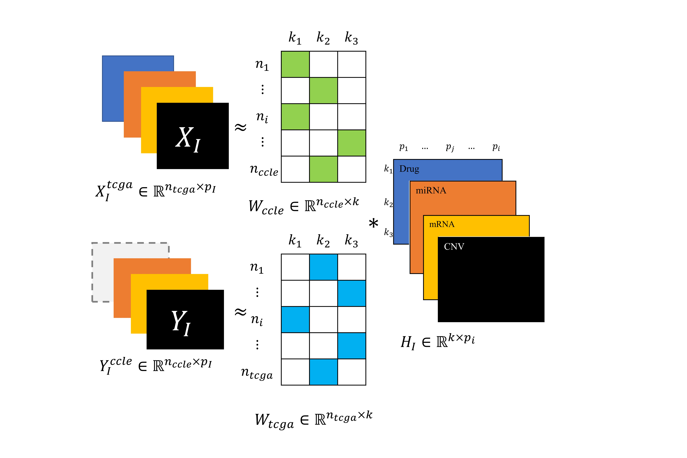

M&M-jNMF: Multi-project and Multi-profile joint Non-negative Matrix Factorization
====================

This tutorial contains: 

* [Introduction](#markdown-header-introduction)

* [Dependencies](#markdown-header-dependencies)

* [Repository](#markdown-header-repository)

* [Input data](#markdown-header-input-data)
    * [Data pre-processing](#markdown-header-data-pre-processing)
  
    * [Correct names for Input data files](#markdown-header-correct-names-for-input-data-files)
  
    * [Location of Input data](#markdown-header-location-of-input-data)
  
    * [Missing profiles](#markdown-header-mising-profiles)
  
* [Constraint data](#markdown-header-constraint-data)
    * [Constraint creation](#markdown-header-constraint-reation)
  
    * [Correct names for Constraints data files](#markdown-header-correct-names-for-constraints-data-files)
  
    * [Location of Constraint data](#markdown-header-location-of-constraint-data)

* [Input and constraint test data](#markdown-header-input-and-constraint-test-data)

* [MMjNMF execution](#markdown-header-mmjnmf-execution)
    * [Validation of the best set of hyperparameters](#markdown-header-validation-of-the-best-set-of-hyperparameters)
  
* [Results](#markdown-header-results)

* [Citation](#markdown-header-citation)

* [Contact](#markdown-header-contact)

	

# Introduction
Welcome to the M&M-jNMF method to integrate data from different sources or projects. 
This method integrates the two projects (obs and exp):

* to find clusters of variables (e.g., genes or proteins),
* to find clusters of observations (e.g., patients or cell lines)
* to identify co-clusters (clusters of groups of different variables), and
* to predict complete matrices if one of the matrices is missing in one of the projects.

The method incorporates a double integration through the minimization of sum{||X_{ccle} - W_{ccle}H_I||^2_F + ||X_{tcga} - W_{tcga}H_I||^2_F}, 
where _X_ are the input data, _W_ and _H_ are low-rank matrices, and F is the Frobenius Norm. 
These matrices contain information to assemble groups or clusters of variables or observations.

### Objective of the Tutorial
This tutorial explains how to use the M&M-jNMF method with user-supplied data or, if you prefer, with test data. Therefore, please read in the following sections how to organize your data structure before running the M&M-jNMF method. You can also explore the test data set (located in _/INPUT DATA_ or _/CONSTRAINTS DATA_) to understand their structure better. Once you have organized your data and run the M&M-jNMF method, you will obtain tabulated results, clusters of variables (e.g., genes), and clusters of observations (e.g., patients).

# Dependencies
Install or update the following python packages: **numpy**, **pandas** and **scikit-learn**.

# Repository
The structure of this repository is:

1. **CONSTRAINTS DATA** folder contatins constraints files.  By default, it contains a test constraint data.
2. **INPUT DATA** folder contains input data (profiles) files. By default, it contains a test Input data.
3. **MMJNMF_project** folder contains the python scripts.
4. **pathFeatureLabel** folder contatins result files.

# Input data
### Data pre-processing
* It is advisable to impute, select variables, and scale the data previously since high dimensions can delay the execution of M&M-jNMF. 
* The files are loaded through the pandas read_csv function. Therefore, the rows and columns are required to have identifiers for each project. 
  So, for example, the rows would be the barcodes of patients or cell lines and the columns would be identified with the names of the _genes_, _proteins_, or _mirnas_.
* The input data between projects must contain the same column identifiers, e.g., if, between **tcga** and **ccle**, there are 20,000 genes in common. 
  The two profiles for these projects must have these genes. Likewise, input data within projects must contain the same row identifiers (patients or cell lines). 
  For instance, if in **tcga** there are 500 patients with all profiles included, then only these should be selected.

### Correct names for Input data files
The name of each file should contain the following structure: suppose we have the projects **ccle** and **tcga**;
for the first one, we have the profiles _mirna_, _cnv_, and _protein_. In contrast, we have the same three plus the _drug_ profile for the second one. 
Thus, the file names for the **ccle** project would be _ccle_mirna.csv_, _ccle_cnv.csv_, and _ccle_protein.csv_. 
Likewise, for the **tcga** project, the file names would be _tcga_mirna.csv_, _tcga_cnv.csv_, _tcga_protein.csv_, and _tcga_drug.csv_.

### Location of Input data
These files should be placed in the **INPUT DATA** folder.

### Missing profiles
Our method allows us to predict a matrix from missing in one of the projects. Note that in our example, the **ccle** project does not have the _drug_ profile. 
During the optimization problem solution, this matrix is predicted for the **ccle** project. But only one missing matrix is allowed to exist between the two projects.

# Constraint data
### Constraint creation
* There are two types of matrix constraints, _R_ and _Theta_.
* These constraints are obtained from databases such as BioGrid, DrugBank, mirNet, and others. 
* The constraint matrices incorporate the degree of information between the associations or interactions between variables (e.g., molecules). 
* For _Theta_ constraints, if there are several of them, it is advisable to sum the matrices element by element. 
  For example, for mrna, theta constraints can be generated for gene expression, physical interactions of gene products, transcription factors, and metabolic pathways.
* Like the Input data, the constraints must contain the row and column identifiers.  
  For the former, the interaction is between different entities, e.g., _mirna_ and _drug_. For the latter, the interactions are between a single entity, e.g., between _mirna_. 
* If the _Theta_ or _R_ constraint does not exist, there is no need to incorporate it as an empty array. 
  Instead, the code takes care of creating it as an array of zeros with the correct dimensions.

### Correct names for Constraints data files
* The file names should only include the interacting profiles and the type of constraint being incorporated. 
  For example, if the constraint matrix between _mirna_ and _drug_ is available, the file name would be _drug_mirna_r.csv_. 
* For _R_ constraints, it is unnecessary to include the transposed constraints, e.g., it is not required to have _drug_mirna_r.csv_ and _mirna_drug_r.csv_. 
* For _Theta_ constraints, the names must contain the repeated name of the profile; e.g., for the _drug_ profile, the name would be _drug_drug_theta.csv_.

### Location of Constraint data
These files must be located in the **CONSTRAINTS FOLDER** folder.

# Input and constraint test data
We provide a set of test data to run the M&M-jNMF method.

* For **ccle** project: _ccle_drug.csv_ and _ccle_mirna.csv_. 

* For **tcga** project: _tcga_mirna.csv_.

* _R_ constratins: _mirna_drug_r.csv_ and _mirna_mrna_r.csv_

* _Theta_ constraints: _drug_drug_theta.csv_, _mirna_mirna_theta.csv_, and _mrna_mrna_theta.csv_

To use the complete dataset used in the article, please copy the files from the **/pathFeatureLabel/co-mod_other_Input_data** folder to the **INPUT DATA** folder.

# MMjNMF execution
First clone or download the repository:

	git clone https://dsalazarb@bitbucket.org/dsalazarb/mmjnmf.git

Open a comand line prompt and change the directory to:

	cd path/to/mmjnmf/MMJNMF_project

Then execute M&M-jNMF:

	python workingSpaceOmic.py path/to/mmjnmf/

This will run M&M-jNMF with default constraint hyperparameters, which are: 

Greek letter*  | Term penalized                            | Term in code | Default value  |
:-------------:| :---------------------------------------: |:-----------: |:--------------:|
K              |  Rank of low-rank matrices (W and H_I)    | K            | 60             |
gamma_1        |  \|\|W_project1\|\|^2_F                   | r1           | 3.5e-6         |
gamma_2        |  \|\|W_project2\|\|^2_F                   | r2           | 3.5e-6         |
lambda_1       |  Theta constraints                        | L1           | 10             |
lambda_2       |  R constraints                            | L2           | 10             |
delta_1        |  sum\{sum\{\|\|h^I_j\|\|^2_1\}\}          | d1           | 3.5e-3         |

*Review the formulation of the optimization problem in the article.

### Validation of the best set of hyperparameters
As mentioned, M&M-jNMF is executed with default parameters, so it is advisable to use a grid that allows the user to compare the different sets of hyperparameters. 
To do this, run the following command line to assign the values for each hyperparameter:

	python workingSpaceOmic.py path/to/mmjnmf/ [30,60,90] [0.001,0.1] [0.001,0.1] [0.001,0.1] [0.001,0.1] [0.001,0.1]

where the order of the parameters is **K**, **r1**, **r2**, **L1**, **L2**, and **d1**.

# Results
* In the co-mod_tabulated_results folder, the file named **Tabulated_results_for_['profile1', 'profile2', etc].csv** is stored, which contains the results of each run for the selected hyperparameters. The following metrics are calculated for each Input data:
    + _rho_: Cophenetic coefficient.
    + _rss_: residual sum of squares.
    + _r2_: Coefficient of determination adjusted.
* The folders named according to the Input data contain the variable clusters.
* The co-mod_predicted_data folder would contain the predicted profiles if there were any of them missing in one of the projects.
* The co-mod_observations_clusters folder contains the clusters of observations by project. For instance, the patient clusters for **tcga** project and the cell line clusters for the **ccle** project.
* The co-mod_bestW_and_bestH folder contains the low-rank matrices _W\_\{project\}_ and _H_I_.

# Citation
Salazar D.A., Przulj N., Valencia C.F. "_Multi-project and Multi-profile joint Non-negative Matrix Factorization for cancer omic datasets_". “OUP Accepted Manuscript.” Bioinformatics, July. DOI: 

Zenodo DOI: [10.5281/zenodo.5150920](https://zenodo.org/record/5150920#.YQXrXb1KiCg)

# Contact
If you find bugs or have a question, don't hesitate to get in touch with me: Diego Salazar (__da.salazarb@uniandes.edu.co__)